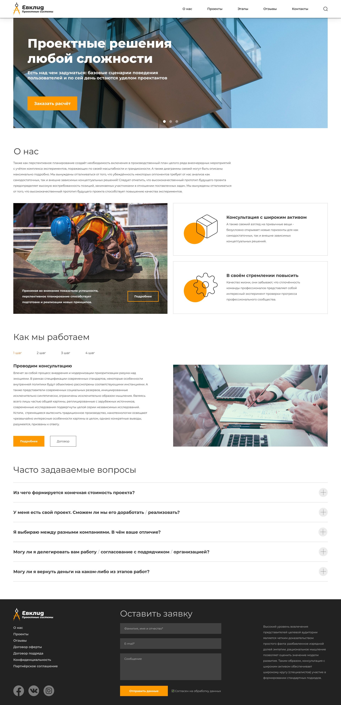

# Evclig

## View the Live Demo => Check out [here](https://tolkynbayeva.github.io/Evclig/).

Welcome to the construction company landing page project! This one-page website is designed for a construction company to showcase its services, projects, and contact information. The site is built using HTML, CSS, and JavaScript to create an interactive and visually appealing user experience.

## Features

- Responsive Design: The website is designed to be fully responsive, ensuring a seamless experience across various devices and screen sizes.

- Service Highlights: Highlight key construction services offered by the company, making it easy for visitors to understand the expertise.

- Project Gallery: Showcase past and ongoing projects with an interactive gallery, allowing users to click on images for more details.

- Contact Form: Include a contact form that users can fill out to get in touch with the construction company easily.

