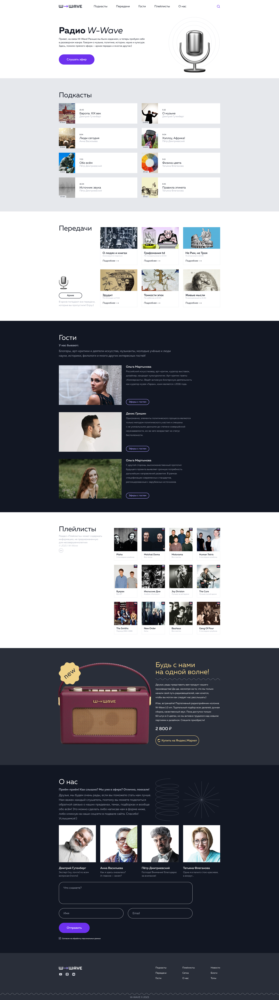

# *W-Wave Radio*

## View the Live Demo => Check out [here](https://tolkynbayeva.github.io/wave_radio/)

## Description

This project aims to deliver a clean, adaptive, and semantically structured layout. The goal is to minimize the number of tags and nesting in the code. The implementation follows Pixel Perfect design, striving for identical rendering across all resolutions with permissible differences of 1–3 pixels.

## Browser Compatibility

The layout must appear identically in all browsers. Testing should cover both portrait and landscape modes, ensuring full content accessibility.

## BEM Naming Convention

The project adheres to the Block Element Modifier (BEM) naming convention for class names. Developers should check their code against the provided checklist for compliance.

## Responsive Design

The project implements a responsive design with minimal media queries. The use of breakpoints in the layout is kept to a minimum, providing a seamless transition between different screen sizes.

## Code Duplication

Efforts are made to minimize code duplication, especially for the mobile version. The goal is to maintain a single source of truth for similar components.

## SVG Icons

SVG icons are utilized for creating site icons. This enhances scalability and ensures a consistent visual appearance.

## Usability

User experience is prioritized, ensuring that all buttons and links are clearly clickable. Hover effects and cursor pointers are implemented. The outline property is removed but substituted with the :focus pseudo-class on all clickable elements.

## Mobile Responsiveness

For mobile devices, hover effects are disabled, and the :active pseudo-class is activated for responsive interactions.

## Flexbox Layout

The project relies on flexbox for layout structuring, avoiding the use of frameworks to maintain simplicity and control.

## HTML and CSS Validation

HTML and CSS documents follow the W3C validation standards. Validation on [https://validator.w3.org/](https://validator.w3.org/) should not yield any errors or warnings.

